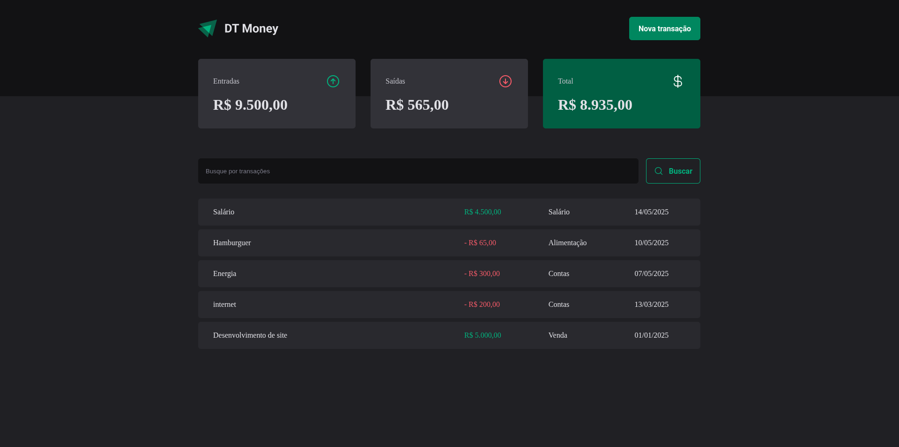
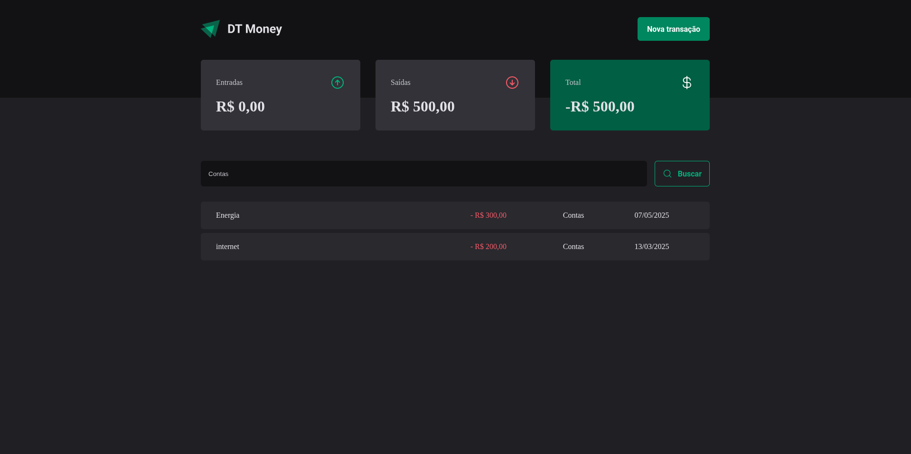
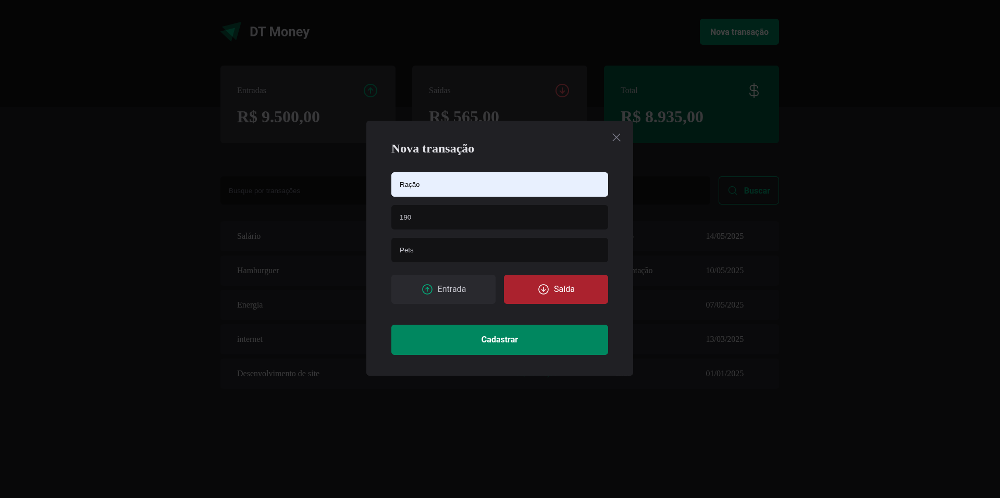

# DT Money

## Esta é uma aplicação de controle financeiro.

    
    
    

# Funcionalidades

- Os valores de entradas, saídas e total são mostrados em tela e mudam de acordo com os novos dados adicionados.

- Cada entrada e saída é mostrada, bem como a data e categoria do a pessoa recebeu ou gastou.

- É possível filtrar por categorias específicas

- Uma nova transação pode ser adicionada: com sua descrição, preço e categoria. Bem como se foi a entrada de algum valor ou saída. Depois é só clicar em "cadastrar" que ela será mostrada na tela inicial.

# Conceitos abordados

- Fetch / Axios

- Requisição HTTP

- Formatação de valores

- Formulários

- Componentização

- JavaScript/TypeScript - Para lógica de programação e tipagem 

- Styled Components - Para estilização da interface

- React Hooks - Para gerenciamento de estado

# Como utilizar

1- Clone o projeto
`git@github.com:helen-andrade/dt-money.git`

2- Instale as dependências
`npm i`

3- Rode o script de desenvolvimento
`npm run dev`

---

    
Feito com ♡ por Helen Andrade

